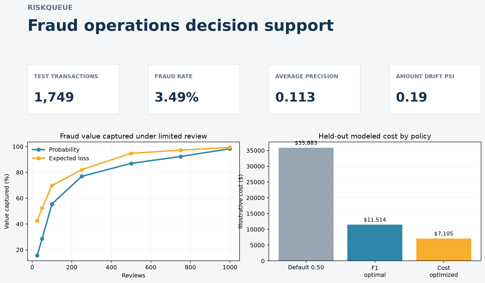
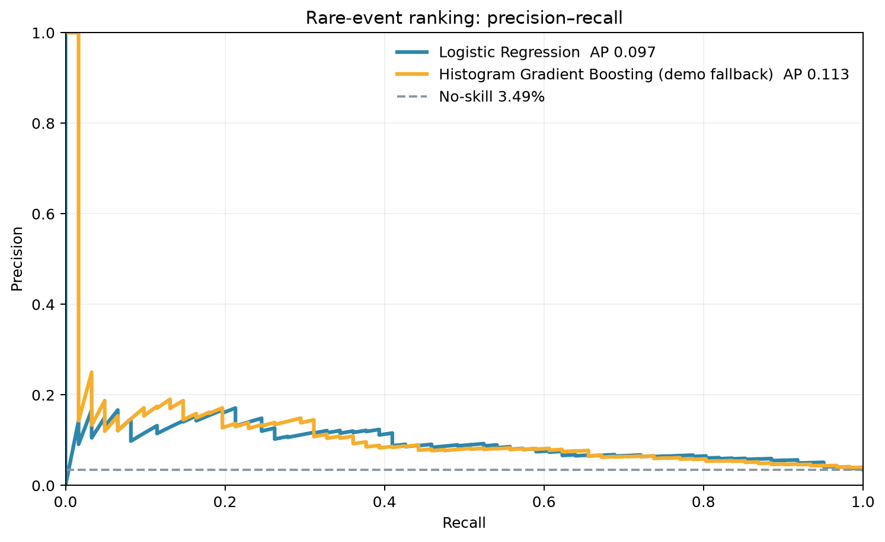
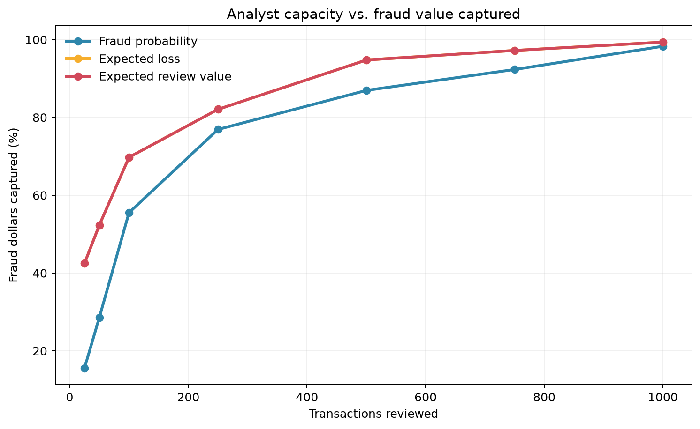
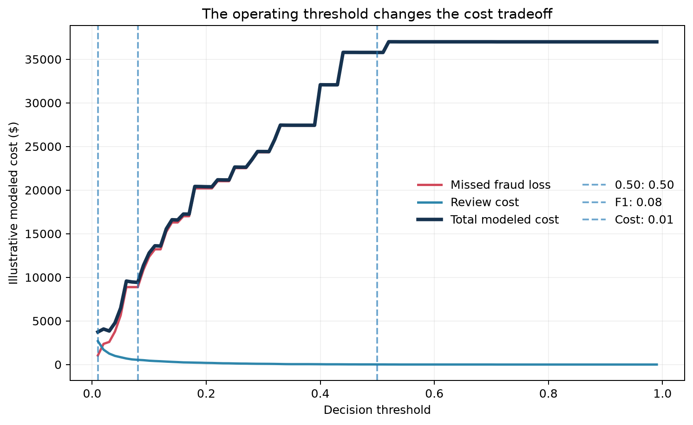
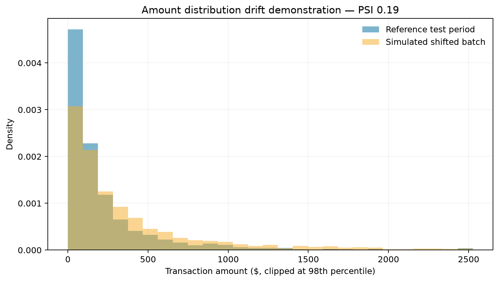
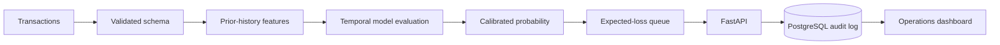

# RiskQueue

### Cost-aware fraud detection & analyst review prioritization

RiskQueue scores transactions, quantifies the dollars exposed, and places the most useful cases into a capacity-limited analyst queue.



**Python · scikit-learn · XGBoost-ready · FastAPI · PostgreSQL · SQLAlchemy · Plotly · Streamlit · Docker · pytest**

> I wanted to build a project where the model was only part of the answer. In a fraud operation, finding suspicious transactions is not enough: analysts have limited time, false alarms create work, and missed cases can carry very different financial exposure. RiskQueue grew from my interest in applied AI that connects technical modeling to practical decisions. Building it helped me think about model quality, calibration, cost assumptions, and review capacity as one system rather than separate exercises. I also wanted the tradeoffs to stay visible, so a reviewer can see why a transaction enters the queue and which assumptions could change that choice.

> [!IMPORTANT]
> The checked-in numbers below are reproducible results from the project’s **deterministic synthetic demo**, not PaySim or a real financial institution. They prove the pipeline runs without shipping a large dataset. Replace them by running the documented PaySim workflow before using the results in a portfolio claim.

| Rare-event ranking | Operational outcome at 750 reviews | Decision policy | Engineering |
|---|---|---|---|
| **0.130 average precision** | **97.1% fraud value captured** with expected-loss ranking | **$9,034 modeled cost** at the validation-selected cost threshold | **10.90 ms p95** for batch 1,000 |
| 3.49% demo fraud rate | vs. 95.1% using probability alone | vs. $34,205 at threshold 0.50 | In-process local benchmark; 57 tests pass |

## Results at a glance

### 1. Can the model find rare cases without overwhelming analysts?



Fraud is a small share of transactions, so accuracy is not a useful headline. Precision–recall shows the fraction of reviewed alerts that are fraud as the system retrieves more fraud cases. On this held-out demo period, the nonlinear model leads on average precision; the absolute score also shows that rare-event ranking remains difficult.

| Held-out demo model | Average precision | ROC-AUC | Brier score |
|---|---:|---:|---:|
| Logistic Regression | 0.097 | **0.749** | 0.158 |
| Histogram Gradient Boosting demo fallback | **0.130** | 0.745 | **0.033** |

### 2. What happens when analysts can review only a limited queue?



The chart measures how much fraudulent transaction value appears in the first *k* reviews. At 750 demo reviews, probability ranking captures 95.1% of fraudulent value, while expected-loss ranking captures 97.1%. The comparison matters because a slightly less likely but much larger transaction can deserve earlier review when the objective is dollars protected.

| Reviews | Probability queue | Expected-loss queue | Improvement |
|---:|---:|---:|---:|
| 100 | 53.6% | **68.3%** | +14.7 points |
| 250 | 79.0% | **85.5%** | +6.5 points |
| 500 | 87.2% | **94.2%** | +7.0 points |
| 750 | 95.1% | **97.1%** | +2.0 points |

### 3. Why is 0.50 not automatically the right threshold?



The score estimates risk; it does not decide the operating policy by itself. The cost-selected threshold was chosen only on the chronological validation period, then evaluated on the final demo period. Under the visible $4 review-cost and 100% loss-fraction assumptions, it reviewed more cases but produced lower modeled total cost than 0.50.

| Policy | Threshold | Reviews | Precision | Recall | Modeled cost |
|---|---:|---:|---:|---:|---:|
| Default | 0.50 | 2 | 100.0% | 3.3% | $34,205 |
| F1-optimal | 0.15 | 78 | 16.7% | 21.3% | $18,613 |
| Cost-optimized | **0.03** | 291 | 9.3% | **44.3%** | **$9,034** |

### 4. Would the system notice changed transaction behavior?



The simulated current batch increases transaction amounts by 80%, producing an amount PSI of 0.19 (`watch`). This is a warning that inputs differ from the reference period—not proof that model quality declined. It tells an operator to investigate data and outcome quality before silently trusting the old policy.

## What I learned

- The best probability ranking was not automatically the best dollar-protection policy.
- A default 0.50 threshold discarded many economically useful reviews under the demo assumptions.
- Calibration quality and ranking quality answer different questions; both are needed when probabilities feed expected-loss calculations.
- Capacity materially changes the sensible evaluation target: case recall alone misses which dollars were captured.
- Monitoring should trigger investigation, not an automatic claim that the model failed.

## Why this matters

Fraud operations combine severe class imbalance, unequal financial exposure, changing behavior, and limited investigation time. RiskQueue keeps those constraints visible and testable. It treats a model score as one input to a decision policy rather than the finish line.

## How it works



The primary split uses whole time steps: earliest 70% for training, next 15% for validation and final 15% for test. History features update state only after a row is transformed. `isFlaggedFraud` and the four balance columns never enter the model feature list.

## Explore in three minutes

```bash
git clone https://github.com/Chats-001/riskqueue.git
cd riskqueue
python -m venv .venv && source .venv/bin/activate
pip install -e '.[dev]'
python scripts/run_demo.py
streamlit run dashboard/app.py
```

Run the API:

```bash
uvicorn riskqueue.api.main:app --reload
curl http://localhost:8000/health
```

Or launch the API, PostgreSQL, and dashboard together:

```bash
docker compose up --build
```

Open `http://localhost:8501` for the dashboard and `http://localhost:8000/docs` for interactive API documentation.

## Repository map

| Path | Purpose |
|---|---|
| `riskqueue/features/` | Static and leakage-safe behavioral feature construction |
| `riskqueue/modeling/` | Baselines, boosting, calibration, metrics, versioned artifacts |
| `riskqueue/decisions/` | Expected loss, thresholds, queue policy and capacity metrics |
| `riskqueue/api/` | Validated single, batch and queue endpoints |
| `riskqueue/db/`, `sql/` | PostgreSQL audit model and six operational analyses |
| `riskqueue/monitoring/` | PSI-based offline drift checks |
| `dashboard/` | Six-view Streamlit decision dashboard |
| `docs/` | Leakage analysis, model card, decision policy and interview notes |
| `tests/` | Synthetic contract, leakage, economics, queue and drift tests |

## Test and quality gates

```bash
ruff check .
pytest
```

CI runs both checks on every push and pull request. It uses compact synthetic fixtures and does not retrain on the full dataset.

### Local development API benchmark

This is an in-process development benchmark on one laptop, not a production throughput claim.

| Batch size | Median | p95 |
|---:|---:|---:|
| 1 | 0.60 ms | 2.73 ms |
| 10 | 0.59 ms | 0.75 ms |
| 100 | 1.20 ms | 1.41 ms |
| 1,000 | 7.50 ms | 10.90 ms |

## Limitations

PaySim is synthetic, the included results are from an even smaller demo scenario, and neither can establish real-world fraud performance. The project lacks real device, identity, network and analyst-outcome data. Historical features are precomputed rather than maintained online. Costs and capacity are simulated. See the [model card](docs/MODEL_CARD.md), [decision policy](docs/DECISION_POLICY.md), and [leakage controls](docs/DATA_LEAKAGE.md).

## Data attribution

The intended primary dataset is PaySim by E. A. Lopez-Rojas, A. Elmir, and S. Axelsson (2016). Setup, source, citation, and repository policy are documented in [data/README.md](data/README.md). The dataset itself is not redistributed here.
