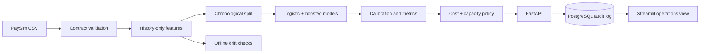

# Architecture

The batch feature builder is intentionally explicit rather than streaming. A real deployment would maintain aggregates in online feature infrastructure; this project precomputes them to keep the methodology reproducible and inspectable.

